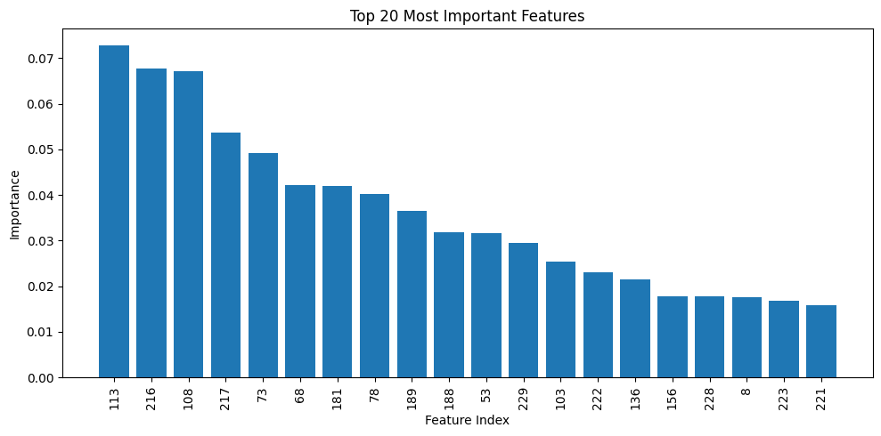

# EEG-Based Epileptic Seizure Detection Using Sample Entropy and Random Forest

## Overview

This project investigates epileptic seizure detection from EEG signals using machine learning techniques on the CHB-MIT Scalp EEG Database.

A baseline Random Forest model using conventional EEG features was reproduced and enhanced through the incorporation of nonlinear EEG complexity measures (Sample Entropy) and class balancing using SMOTE.

## Highlights

* Reproduced a baseline Random Forest seizure detection model
* Introduced Sample Entropy for nonlinear EEG complexity analysis
* Applied SMOTE to address severe class imbalance
* Improved average sensitivity from **68.3%** to **80.8%**
* Improved average F1 score from **0.785** to **0.866**
* Maintained classification accuracy above **99%**
* Evaluated on multiple CHB-MIT seizure recordings

## Research Objective

The objective of this work is to improve seizure detection performance by addressing two common limitations of traditional machine learning approaches:

* Limited representation of nonlinear EEG dynamics
* Severe class imbalance between seizure and non-seizure EEG segments

## Research Gap

Traditional machine learning approaches for EEG seizure detection often rely solely on time-domain and frequency-domain features and may not adequately capture nonlinear EEG dynamics. Additionally, severe class imbalance between seizure and non-seizure segments can reduce seizure sensitivity.

This work addresses these limitations through:

* Sample Entropy-based nonlinear feature extraction
* SMOTE-based class balancing
* Threshold optimization for improved seizure detection

## Dataset

### CHB-MIT Scalp EEG Database

* Source: PhysioNet
* Sampling Frequency: 256 Hz
* Number of Channels: 23 EEG channels
* Window Length: 1 second
* EEG Type: Scalp EEG

## Methodology Pipeline

CHB-MIT EEG Signals

↓

Bandpass Filtering (0.5–30 Hz)

↓

Z-score Normalization

↓

1-Second Window Segmentation

↓

Time-Domain Features

*

Frequency-Domain Features

*

Sample Entropy

↓

SMOTE Oversampling

↓

Random Forest Classification

↓

Threshold Optimization

↓

Seizure Detection

## Feature Extraction

### Time-Domain Features

* Mean
* Variance
* Root Mean Square (RMS)
* Line Length
* Zero Crossing Rate

### Frequency-Domain Features

* Delta Band Power
* Theta Band Power
* Alpha Band Power
* Beta Band Power
* Gamma Band Power

### Nonlinear Feature

* Sample Entropy

## Classification

* Random Forest Classifier
* SMOTE Oversampling
* Threshold Optimization

## Feature Importance Analysis

The Random Forest classifier was used to identify the most informative EEG features for seizure detection.



The Random Forest model identified several highly discriminative EEG features for seizure detection. The most important features were associated with temporal dynamics, spectral characteristics, and nonlinear EEG complexity measures, highlighting the value of combining conventional EEG features with Sample Entropy.

## Experimental Results

### Average Performance Across Recordings

| Metric      | Baseline Random Forest | Proposed Method |
| ----------- | ---------------------: | --------------: |
| Accuracy    |                 99.63% |      **99.77%** |
| Sensitivity |                  68.3% |       **80.8%** |
| F1 Score    |                  0.785 |       **0.866** |

### Recording-wise Performance

| Recording | Accuracy | Sensitivity | F1 Score |
| --------- | -------: | ----------: | -------: |
| CHB01_03  |   99.86% |      100.0% |    0.941 |
| CHB01_04  |   99.86% |       80.0% |    0.889 |
| CHB01_15  |   99.58% |       62.5% |    0.769 |

## Key Findings

* Improved average sensitivity by **12.5%**
* Improved average F1 score by **10.3%**
* Maintained classification accuracy above **99%**
* Demonstrated the effectiveness of entropy-based EEG complexity measures for seizure detection
* Showed improved detection performance compared to the baseline Random Forest approach

## Technologies Used

* Python
* NumPy
* SciPy
* MNE
* WFDB
* Scikit-learn
* Imbalanced-learn
* AntroPy
* Matplotlib

## Repository Structure

```text
EEG-Seizure-ML-Baseline-and-Improvement/
│
├── phase1_preprocessed_chbmit.py
├── phase2_feature_extraction.py
├── requirements.txt
├── README.md
└── results/
```

## Future Work

* Evaluate on additional CHB-MIT recordings
* Compare performance against deep learning architectures
* Investigate patient-independent seizure detection
* Explore additional nonlinear EEG biomarkers

## Author

**Tanishka Bajpai**

Biomedical Engineering (Medical Intelligence)

Research Project: EEG-Based Epileptic Seizure Detection Using Machine Learning

GitHub: Tanishkaaa016

